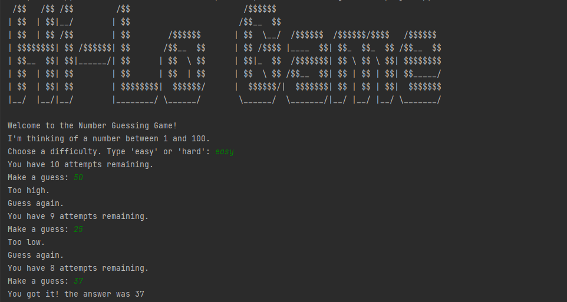

# Guess the Number

### In this Game a Random number will be generated, and you will have to guess that number. You will be given chances according to the difficulty you choose.

## Summary
### This was a simple Project, I learned Scope of Variables/Identifiers. Scope is very Crucial in programming.

